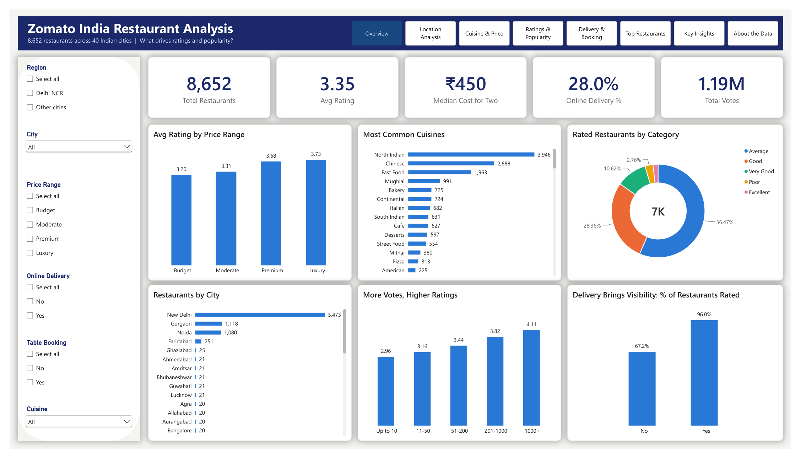
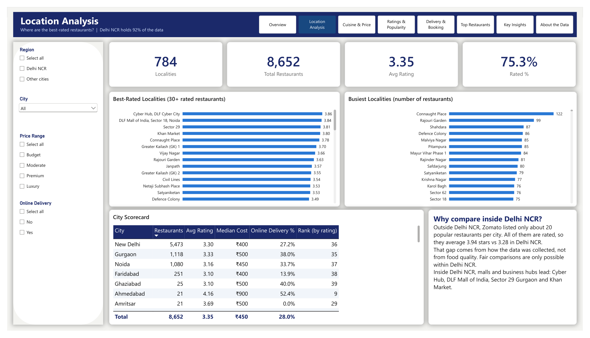
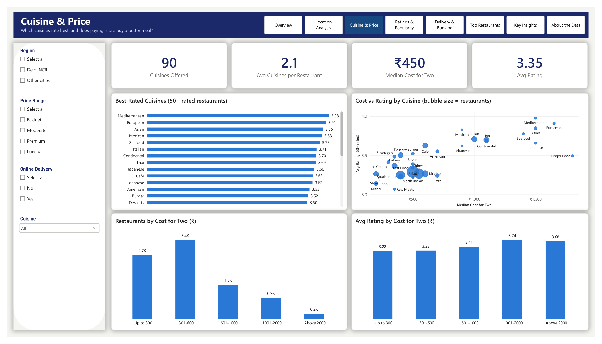
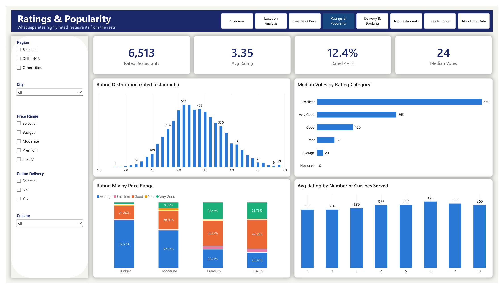
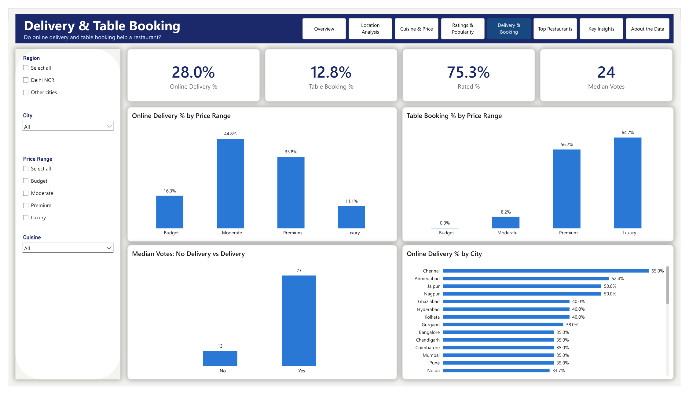
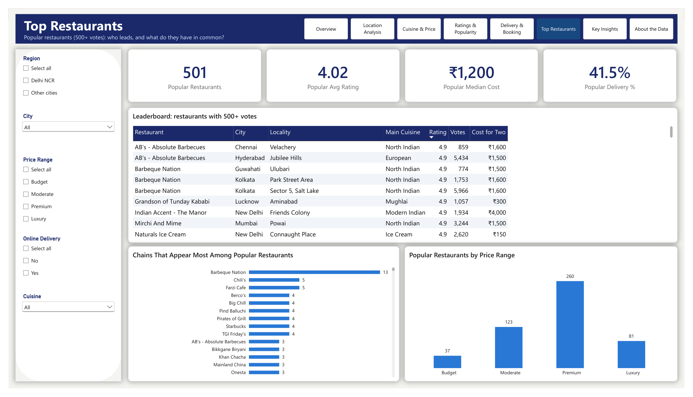
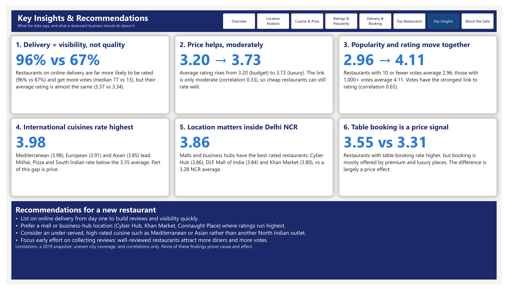

# Zomato India Restaurant Analysis

**What makes a restaurant on Zomato highly rated and popular?** An end-to-end analysis of 8,652 restaurants in India, from raw data to an 8-page interactive Power BI dashboard.

**Tools:** Python (pandas, NumPy, Matplotlib, SciPy) · Jupyter · Power BI (Power Query, DAX, star schema) · Git



---

## Key findings

| # | Finding | Evidence |
|---|---|---|
| 1 | **Online delivery brings visibility, not higher ratings** | 96% of delivery restaurants are rated vs 67% of others, with median votes of 77 vs 13. Average rating is almost the same: 3.37 vs 3.34. |
| 2 | **Ratings rise with price, but only moderately** | 3.20 (budget) → 3.73 (luxury); Spearman correlation 0.33 |
| 3 | **Popularity and rating move together** | ≤10 votes: 2.96 avg rating; 1,000+ votes: 4.11 (correlation 0.65) |
| 4 | **International cuisines rate highest** | Mediterranean 3.98, European 3.91, Asian 3.85 vs 3.35 overall |
| 5 | **Malls and business hubs lead in Delhi NCR** | Cyber Hub 3.86, DLF Mall of India 3.84, Khan Market 3.80 vs 3.28 NCR average |
| 6 | **Table booking is mostly a price signal** | 0% of budget restaurants offer booking vs 65% of luxury ones |
| 7 | **City comparisons are biased** | Outside Delhi NCR only ~20 popular restaurants per city were listed (100% rated, 3.94 avg), so cities are compared only within Delhi NCR |

**Recommendation for a new restaurant:** list on delivery from day one to build reviews, prefer a mall or business-hub location, and consider an under-served, high-rated cuisine (e.g. Mediterranean or Asian) over another North Indian outlet.

---

## Business questions

1. Where are restaurants located, and how do cities and localities compare?
2. Which cuisines are most common, and which are rated highest?
3. Does a higher price mean a higher rating?
4. Do online delivery and table booking link to better ratings or more votes?
5. What do the top-rated, most-voted restaurants have in common?

## Dataset

- **Source:** [Zomato Restaurants Data](https://www.kaggle.com/datasets/shrutimehta/zomato-restaurants-data) (Kaggle, Shruti Mehta), a snapshot from around 2019
- **Raw:** 9,551 restaurants × 21 columns across 15 countries
- **Used:** 8,652 restaurants in India (91% of the file)

## Process

### 1. Data cleaning (Python): [`notebooks/01_data_cleaning.ipynb`](notebooks/01_data_cleaning.ipynb)
- Loaded the file with `latin-1` encoding (it is not UTF-8)
- Filtered to India and kept 14 useful columns; checked for duplicates (none found)
- **2,139 restaurants had a rating of 0, meaning "not rated".** Set them to missing so they don't drag averages down: the average rating goes from 2.52 (wrong) to 3.35 (correct)
- 9 restaurants with a cost for two of ₹0 set to missing; 5-star hotel prices (up to ₹8,000) kept as genuine
- Merged twin cities (Secunderabad → Hyderabad; Panchkula and Mohali → Chandigarh)
- Created `is_rated`, `region`, `primary_cuisine`, `cuisine_count` and `cost_bucket`, plus a restaurant–cuisine table (one row per restaurant per cuisine)

### 2. Exploratory analysis (Python): [`notebooks/02_eda.ipynb`](notebooks/02_eda.ipynb)
Each business question answered with charts and a written finding, including a Welch's t-test for the delivery rating gap and a check for confounding (table booking vs price).

### 3. Data model (Power BI)
Star schema with a fact table, four lookup tables and a bridge table for the many-to-many relationship between restaurants and cuisines:

```
DimCity ─────────┐
DimPriceRange ───┼──< Restaurants >──< RestaurantCuisines >── DimCuisine
DimCostBucket ───┘         (bridge table, filters both directions)
```

28 DAX measures in a dedicated `_Measures` table, for example:

```DAX
Online Delivery % =
DIVIDE ( CALCULATE ( [Total Restaurants], Restaurants[has_online_delivery] = 1 ) + 0, [Total Restaurants] )

Avg Rating (30+ rated) = IF ( [Rated Restaurants] >= 30, [Avg Rating] )

City Rank by Rating =
IF ( HASONEVALUE ( DimCity[city] ), RANKX ( ALL ( DimCity[city] ), [Avg Rating], , DESC, DENSE ) )
```

All measures are listed in [`dashboard/dax_measures.md`](dashboard/dax_measures.md).

### 4. Dashboard (Power BI, 8 pages)

| Page | Question it answers |
|---|---|
| Overview | What does the market look like? |
| Location Analysis | Where are the best-rated restaurants? |
| Cuisine & Price | Which cuisines rate best, and does price matter? |
| Ratings & Popularity | What separates highly rated restaurants? |
| Delivery & Booking | Do these services help a restaurant? |
| Top Restaurants | Who leads among popular restaurants (500+ votes)? |
| Key Insights | What should a business do? |
| About the Data | Source, cleaning steps and limitations |

Every page has slicers (region, city, price range, delivery, cuisine) and page-navigation buttons. A PDF of all pages is in [`dashboard/zomato_dashboard.pdf`](dashboard/zomato_dashboard.pdf).

## Dashboard pages

| | |
|---|---|
|  |  |
|  |  |
|  |  |

## Limitations

- Delhi NCR is 92% of the data; other cities have only ~20 popular restaurants each, so cross-city comparisons are biased
- A single snapshot, so no trends over time
- Findings show correlation, not cause and effect
- 496 restaurants have missing coordinates, so no map visual is used

## Project structure

```
zomato-india-analysis/
├── data/
│   ├── raw/                  zomato.csv, Country-Code.xlsx
│   └── processed/            cleaned data + lookup tables for Power BI
├── notebooks/
│   ├── 01_data_cleaning.ipynb
│   └── 02_eda.ipynb
├── dashboard/
│   ├── zomato_dashboard.pbip           open this in Power BI Desktop
│   ├── zomato_dashboard.Report/        report pages (PBIR format)
│   ├── zomato_dashboard.SemanticModel/ data model and DAX (TMDL format)
│   ├── zomato_dashboard.pdf            all 8 pages as a PDF
│   ├── dax_measures.md
│   └── zomato_theme.json
├── images/                   EDA charts and dashboard screenshots
└── requirements.txt
```

## How to run

1. Clone the repo and install the Python packages: `pip install -r requirements.txt`
2. Run `notebooks/01_data_cleaning.ipynb`, then `notebooks/02_eda.ipynb`
3. Open `dashboard/zomato_dashboard.pbip` in Power BI Desktop. The Power Query sources point to `C:\Users\dell\Documents\zomato-india-analysis\data\processed\`; if your folder is different, update the paths in **Transform data → Advanced Editor** and refresh.

## Author

**Aditya Kale**: [LinkedIn](https://www.linkedin.com/in/adityak0012) · [GitHub](https://github.com/Adityak0012) · [Kaggle](https://www.kaggle.com/adityak321)
